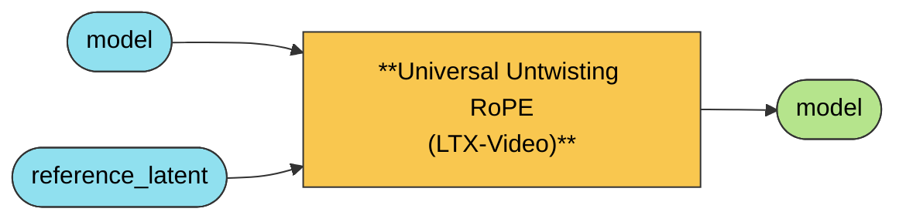

# Universal Untwisting RoPE (LTX-Video)

Untwisting RoPE for LTX-Video. Consolidates David's three separate LTX packs (Basic,
D-Structure, LTX-zip) into one node with a mode selector: it scales the spatial (h/w) RoPE
frequencies per transformer block, optionally injects reference tokens into self-attention
(StyleAligned-style), and AdaIN-matches tone at block 0.

**Not yet validated end-to-end.** The merge is faithful to David's tested param names and
mappings, but hasn't been run against real LTX-Video generations in this repo. Treat the defaults
as a starting point and tune from there.

## Wiring

`reference_latent` is a plain LATENT, encoded outside this node. The patched `model` goes straight
to the sampler like any other model patch.

## Controls

| Input | Default | What it does |
|---|---|---|
| `attenuation` | `0.1` | High-frequency spatial (structural) attenuation. `0` is neutral; the effective scale is clamped to ≥0. |
| `semantic` | `0.1` | Low-frequency spatial (semantic) suppression. `0` is neutral, `1` fully suppresses it. |
| `adain_strength` | `0.3` | Color/tone style via AdaIN at block 0. `0` turns it off. |
| `structure_strength` | `0.0` | Structural style via token injection (StyleAligned): reference tokens get prepended to self-attention so the result copies shapes and composition. `0` is off, matching the original Basic/LTX-zip behavior. |
| `reference_mode` | `per_step` | `per_step` runs the reference at every step's sigma: precise, full-strength AdaIN, one extra forward pass per step. `single_pass` runs the reference once at a fixed sigma (`0.15`): faster, with AdaIN gated by sigma. |
| `verbose` | `false` | Prints block count, mode, and resolved scales to the console. |

`reference_mode=per_step` with `structure_strength=0` reproduces David's Basic pack;
`structure_strength>0` adds D-Structure's token injection; `single_pass` reproduces LTX-zip.

---
[← All Universal Untwisting RoPE nodes](../README.md)
