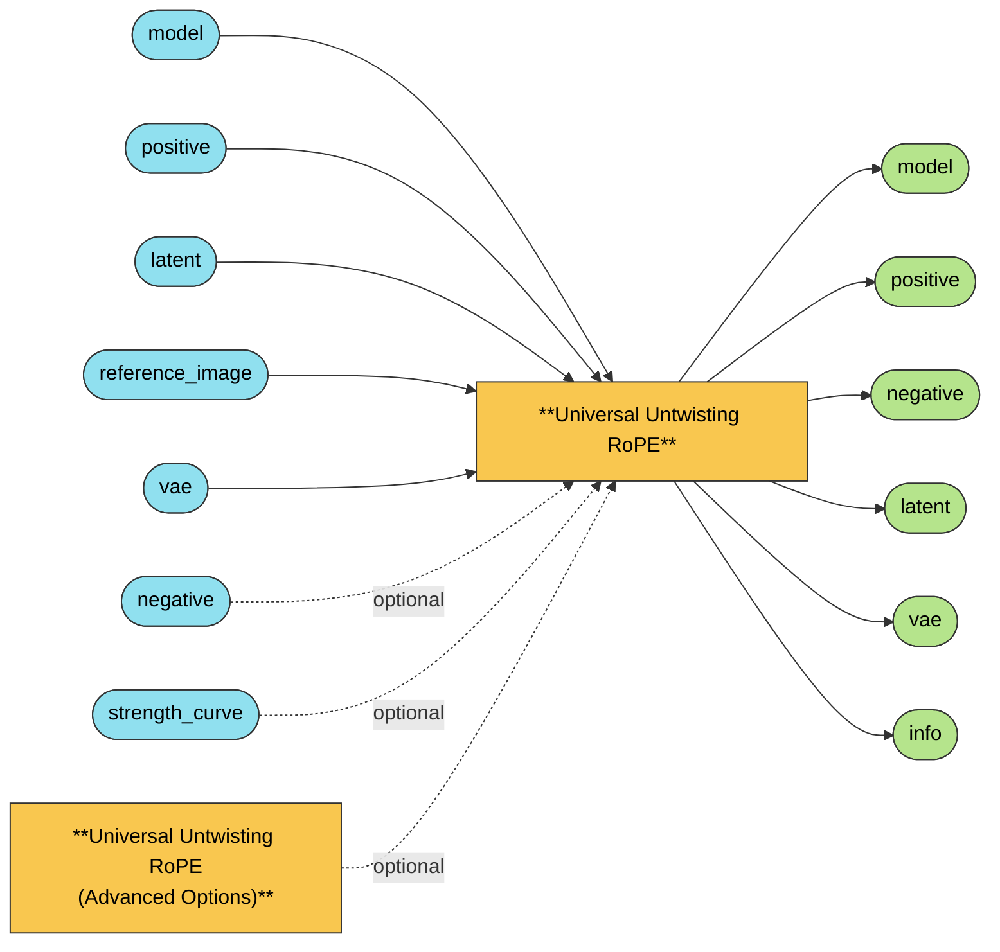

# Universal Untwisting RoPE

Training-free style transfer for image DiTs. One node auto-detects the loaded model (Z-Image,
Anima, Flux.1, Flux.2/Klein, Qwen-Image, KREA2), runs RF inversion and the RoPE attention patch
internally, and resizes + VAE-encodes the reference for you. An optional second node exposes the
fine-tuning knobs without cluttering the main node.

Its slot order mirrors a presampling node's output column (model / positive / negative / latent /
image / vae), so it wires into an NKD Klein/Krea Tools chain as short parallel cables instead of
wires flying over the node. `negative` and `vae` pass straight through to the sampler.

## Wiring

`positive` doubles as the reference conditioning: the node inverts the reference image against
that same prompt, so feed it the target prompt, not a description of the reference. `latent` is
the empty/generation latent; `reference_image` is resized to its exact grid and VAE-encoded
internally, then the original `latent` is passed straight through to the `latent` output.

## Supported models

| Family | Source |
|---|---|
| Z-Image / Z-Image Turbo | engine |
| Anima | engine |
| Flux.2 family (incl. FLUX.2 Klein) | engine + David |
| Flux.1 family (Flux / Schnell / Inpaint, incl. FLUX.1-Depth-dev) | Nekodificador |
| Qwen-Image / Edit family | engine |
| KREA2 | David |

## Universal Untwisting RoPE: controls

| Input | Default | What it does |
|---|---|---|
| `structure_start` | `1.0` | High-frequency scale (composition/shape) at the start of denoising. 0 = the reference contributes nothing in that band; negative values invert the reference attention (anti-reference) instead of reducing it further. |
| `structure_end` | `0.0` | Structure at the end of denoising. Ramps from `structure_start` along the curve picked by `schedule_curve`. |
| `style_start` | `1.0` | Low-frequency scale (global feel/palette) at the start of denoising. |
| `style_end` | `3.0` | Style at the end of denoising. Higher pulls more of the reference's palette in by the end. |
| `schedule_curve` | `linear` | Shapes how structure/style ramp between start and end: `linear` (constant rate), `ease_in`, `ease_out`, `ease_in_out`/`smoothstep` (S-curve), `exponential` (flat then sharp at the end), `logarithmic` (the mirror of exponential). |
| `strength_curve` *(optional)* | — | Per-step multiplier (a FLOAT list, e.g. from NKD Sigmas Curve) applied on top of structure/style. Flat `1.0` is neutral; it multiplies rather than overwrites. |
| `extensions` *(optional)* | — | Advanced Options pack, see below. |

`info` (output) prints the resolved adapter, the effective structure/style/curve, and whichever
Advanced Options overrides are in play, both to the node and to the console.

## Advanced Options: controls

Optional. Skip it and the main node already ships a validated preset; add it only once a specific
result is off, and change one slider at a time.

| Input | Default | Symptom it fixes |
|---|---|---|
| `color_transfer` | `1.0` | Raise if the reference's color/tone didn't come across; lower if it stole colors you wanted to keep. |
| `texture_transfer` | `1.0` | Raise if it took the colors but not the brushwork/grain/material; lower if the surface gets too busy. |
| `bleeding_fix` | `0.0` | Raise if the style leaks into areas where it doesn't belong. Applies the reference only where target and reference actually correspond. |
| `style_adherence` | `0.35` | Raise in small steps if the result still doesn't look enough like the reference. First slider to lower if the image goes stiff or lifeless. |
| `looseness_scale` | `1.0` | Raise if it copies the reference's shapes too literally; lower if it ignores the reference's composition. A multiplier on the model's own value, not an absolute (the underlying value differs ~50x between models). |
| `tone_match` | `1.0` | Raise if contrast/brightness doesn't match the reference; lower if the result comes out flat or washed out. |
| `blocks` *(optional)* | *(model default)* | Debug knob for tuning per-model profiles, e.g. `7-27` or `0-8,28-37`. Not for day-to-day artwork; a wrong range silently produces garbage or no effect at all. |

### What each slider actually does

- `color_transfer` and `tone_match` both work through AdaIN (Adaptive Instance Normalization),
  matching statistics between target and reference. `tone_match` overrides the model's own AdaIN
  strength; `color_transfer` runs a second, post-attention AdaIN pass, an idea borrowed from
  [ConsiStory's feature injection](https://arxiv.org/abs/2402.03286) (implemented here without its
  masks or spatial correspondence maps, as a simpler global match).
- `texture_transfer` applies AdaIN to the target's V (value) tensor, restricted to the reference
  channels with the highest variance.
- `bleeding_fix` gates V injection by cosine similarity: reference V only mixes into target V
  where the two agree. Conceptually close to
  [CACTIF's similarity-filtered attention](https://arxiv.org/abs/2505.16360), implemented here as a
  lighter token-local gate.
- `style_adherence` projects the target's K (key) tensor onto the reference K direction. Most
  effective at low values (around `0.1`).
- `looseness_scale` scales `beta`, the steepness of the frequency-scale curve the engine builds
  per model; the per-model base values differ enough that only a relative multiplier makes sense
  as a single cross-model widget.

### RF inversion solvers (per-model, not user-facing)

Each model gets a hidden profile (RF solver, `beta`, `blocks`, AdaIN strength) tuned once and
reused. The solvers available internally: `linear` (no model calls, random noise), `rf_gamma`
(Euler), `rf_gamma_rk2` (Runge-Kutta midpoint),
[FireFlow](https://arxiv.org/abs/2412.07517) recurrence,
[RF-Solver / RF-Edit](https://arxiv.org/abs/2411.04746), and
[FlowTurbo](https://arxiv.org/abs/2409.18128) (`endpoint_heun` / `flowturbo_pc`). Optional
smoothing on top: [PMI](https://arxiv.org/abs/2602.11850) (a running mean across steps) and
[OTIP](https://arxiv.org/abs/2508.02363) (nudges the trajectory toward a better image-to-noise
path). KREA2 reuses David's tuned wrapper values (`flowturbo_pc`, `blocks=7-27`); the rest of the
image models fall back to the engine defaults until tuned individually.

---
[← All Universal Untwisting RoPE nodes](../README.md)
